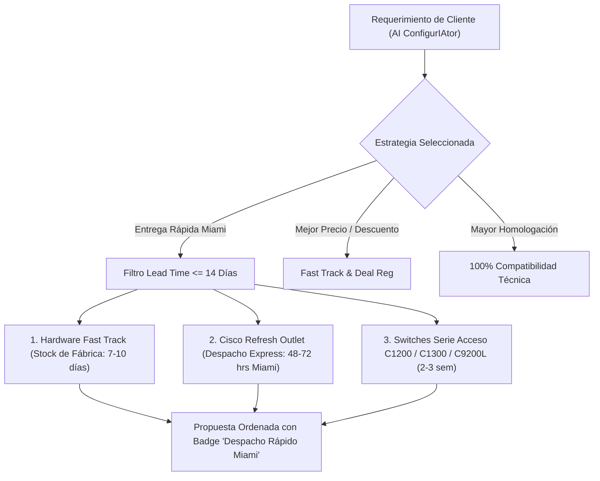

# Plan Estratégico: Extracción de Capacidades CCW, Estimated Lead Time y Logística a Bodegas de Miami
**Plataforma:** Cisco Automated v2.1  
**Fecha:** Octubre 2026  
**Ubicación:** `docs/PLAN_MEJORAS_CCW_LEAD_TIME_MIAMI.md`  

---

## 1. Diagnóstico Técnico: APIs Actuales vs. Estimated Lead Time

### 1.1 Estado de las APIs Conectadas (`apix.cisco.com`)
Actualmente, Cisco Automated cuenta con 7 servicios integrados vía OAuth2 M2M:
1. **Cisco PSIRT openVuln v2:** Consulta en vivo de vulnerabilidades, CVEs y boletines de seguridad.
2. **Datafoundation-POE:** Presupuesto de Watts (802.3af/at/bt), cálculo de puertos PoE y recomendación de fuentes de poder (PSU).
3. **CX Cloud V2 (Inventory, Contracts, Alerts, Customer):** Inventario instalado, vigencia de contratos SmartNet y alertas de ciclo de vida (EOL/EOS).
4. **HelloCommerce API v1:** Pasarela de autenticación e integración comercial B2B.

### 1.2 Limitación de la API de Cisco para Lead Times
* **Realidad de Cisco APIX:** Cisco **no dispone de un endpoint REST público y abierto** (por ejemplo, `GET /lead-time?sku=...`) para consultar en tiempo real los días de fabricación de cualquier SKU de manera aislada sin tener un contrato B2B EDI directo (reservado a Distribuidores Directos Tier 1 globales).
* **Cómo maneja CCW el Lead Time:**
  1. **En exportaciones de Estimates/Quotes:** Cada archivo Excel exportado desde CCW contiene la columna oficial `Estimated Lead Time (Days)`. En el motor [excelEngine.ts](file:///C:/Users/Adm/antigravity/Remix-Cotizador-Automático-Cisco---Intcomex/src/core/excelEngine.ts) ya se extrae este dato y se transforma mediante la fórmula logística de [calculations.ts](file:///C:/Users/Adm/antigravity/Remix-Cotizador-Automático-Cisco---Intcomex/src/core/calculations.ts):
     $$\text{Semanas a Pedido} = \left\lceil \frac{\text{Días CCW}}{7} \right\rceil + 2 \text{ semanas de tránsito}$$
     *(Si el valor es $\le 2$ días, se considera stock inmediato).*
  2. **Herramienta "Lead Times Tool" en CCW:** Es una herramienta web accesible desde el menú *Related Tools* de CCW que permite consultar por SKU, familia o descripción y exportar la matriz oficial completa en Excel o PDF.

---

## 2. Solución Arquitectónica: Optimización de Entrega a Bodegas de Miami

Para asegurar que los ejecutivos entreguen **siempre el mejor equipo técnico y que además llegue sin demoras a las bodegas del forwarder en Miami**, se diseñó una solución en cuatro niveles:

### Capa 1: Modo de Ordenamiento "Entrega Rápida Miami" en AI ConfigurIAtor
* **Nuevo Sort Mode:** Agregar a `ProposalPrioritySortMode` el valor `fastest_shipping` ("Despacho Rápido a Miami").
* **Comportamiento:** Prioriza equipos con disponibilidad inmediata o lead time reducido ($\le 14$ días a Miami), ubicando al final modelos con alta lista de espera de fabricación (ej. chasis modulares o switches complejos con más de 6 a 8 semanas).

### Capa 2: Matriz Heurística de Lead Times por Familia (Caché Logístico Miami)
Cuando no se disponga de un archivo de Estimate previo, el ConfigurIAtor aplicará los tiempos de entrega promedio observados hacia los forwarders de Miami:
* **Fast Track / Promocionales:** 1 a 2 semanas a Miami.
* **Cisco Catalyst 1200 / 1300 / 9200L:** 2 a 3 semanas.
* **Firewalls Firepower FPR1000 / FPR1100:** 1 a 2 semanas.
* **Catalyst 9300X / 9400 / Nexus 9000:** 6 a 10 semanas (con alerta de posible cuello de botella).
* **Transceivers / Accesorios / Cables de Poder:** Stock continuo ($\le 7$ días).
* **Cisco Refresh (Equipos Certificados):** Stock inmediato en USA ($\le 48-72$ horas a Miami).

### Capa 3: Sincronizador de "Lead Times Tool" (CCW Export)
* Permitir la importación del archivo Excel descargado desde la herramienta *Lead Times Tool* de CCW.
* Almacenar y sincronizar la matriz en Firestore bajo la colección `cisco_lead_times_catalog` (con persistencia idéntica a la implementada para Fast Track).

### Capa 4: Alternativas con "Cisco Refresh Outlet" (-RF)
* Si el equipo nuevo solicitado presenta un tiempo de espera prolongado (ej. $> 6$ semanas), el ConfigurIAtor sugerirá la opción oficial **Cisco Refresh** (sufijo `-RF`):
  * **Ventaja 1:** Despacho en $24-48$ horas hacia Miami (stock en almacenes de EE.UU.).
  * **Ventaja 2:** Garantía completa de Cisco y soporte SmartNet idéntico a hardware nuevo.
  * **Ventaja 3:** Descuentos adicionales de hasta 70% a 80% sobre precio de lista.

---

## 3. Las 7 Herramientas Estratégicas del Menú CCW para Extraer a Cisco Automated

A partir del análisis del menú lateral de CCW (*Quick Links*), se seleccionaron las 7 herramientas con mayor retorno de inversión técnica y comercial:

| # | Herramienta en CCW | Categoría en CCW | Impacto en Cisco Automated | Módulo de Destino |
| :-: | :--- | :--- | :--- | :--- |
| **1** | **Lead Times Tool** | *Related Tools* | Estimación precisa de tiempos de despacho de fábrica y previsión de arribo a Miami. | AI ConfigurIAtor & BO Tracking |
| **2** | **Cross Reference Tool** | *Related Tools* | Homologación automática de modelos obsoletos (ej. 2960X) o de marcas competidoras (Aruba, Fortinet, Huawei) a equivalentes Cisco 2026. | AI ConfigurIAtor (Homologación) |
| **3** | **Cisco Refresh Outlet (New)** / *Cisco Certified Refurbished Equipment* | *Ordering Tools & Financing* | Alternativa de equipos remanufacturados certificados oficiales con **despacho inmediato (< 48 hrs a Miami)** y precios competitivos. | AI ConfigurIAtor (Alternativas Rápidas) |
| **4** | **Price Protection Expiration (Alerta 14 Días)** | *Banner Superior* | Monitor de vigencia de cotizaciones CCW para alertar antes de que venzan los precios protegidos y se pierdan márgenes. | Historial de Estimates & Dashboard |
| **5** | **Find Product Supports Service (SMARTnet / SAM)** | *Products and Services Info* | Identificación automática del SKU de servicio SmartNet (`CON-SNT-*`) que le corresponde a cada chasis base. | Motor de Cálculo & Pricing Engine |
| **6** | **Smart Account / Virtual Account Lookup Tool** | *Products and Services Info* | Verificación del Smart Account del cliente final previa a la orden para evitar bloqueos en licenciamiento DNA o Meraki. | Estimate View & Módulo BO |
| **7** | **Trade Tool (TMP - Technology Migration Program)** | *Related Tools* | Cálculo de descuentos y créditos de canje por devolución de equipamiento antiguo del cliente. | Quick Calculator & AI ConfigurIAtor |

---

## 4. Detalle Operativo de las Funcionalidades Clave

### 4.1 Cross Reference Tool (Homologación Universal)
* **Objetivo:** Cuando un cliente solicita cotizar una lista con equipos de la competencia (ej. `Aruba 2930F-24G-4SFP+` o `FortiSwitch 148F-FPOE`) o equipos Cisco descatalogados (`WS-C2960X-48FPS-L`), el sistema realiza la traducción inmediata al modelo vigente 2026 (`C9200L-48FP-4X-E` o `MS225-48FP`).
* **Beneficio:** Convierte requerimientos externos en propuestas homologadas listas para exportar a CCW en segundos.

### 4.2 Monitor de Price Protection (Alerta de 14 Días)
* **Objetivo:** En CCW, los descuentos aprobados cuentan con un plazo de protección (típicamente 30 a 90 días). Si el cliente no formaliza la orden de compra antes del vencimiento, los costos aumentan.
* **Visualización en Historial de Estimates:**
  * 🟢 **Vigente:** $> 14$ días de vigencia restante.
  * 🟡 **Alerta Crítica (14 días):** $\le 14$ días restantes (badge ámbar con aviso al vendedor para cerrar la OC).
  * 🔴 **Caducado:** Deal expirado, requiere re-cotización en CCW.

### 4.3 Integración de SmartNet Automático (SAM / Find Product Supports Service)
* **Objetivo:** Garantizar que cada hardware cotizado en el ConfigurIAtor o tabla interactiva sugiera de forma nativa su contrato de soporte técnico correspondiente (`CON-SNT-*`, `CON-SNTC-*`), aplicando automáticamente las reglas de intangibles (sin arancel ni internación).

---

## 5. Hoja de Ruta de Implementación Propuesta

### Fase 1: Logística Miami y Lead Time en AI ConfigurIAtor
1. Incorporar la propiedad `leadTimeMiamiWeeks` y el modo `fastest_shipping` en [catalogRules.ts](file:///C:/Users/Adm/antigravity/Remix-Cotizador-Automático-Cisco---Intcomex/src/modules/configuriator/catalogRules.ts).
2. Agregar el selector de ordenamiento "🚀 Despacho Rápido Miami" en la interfaz de [ConfiguriatorView.tsx](file:///C:/Users/Adm/antigravity/Remix-Cotizador-Automático-Cisco---Intcomex/src/modules/configuriator/ConfiguriatorView.tsx).
3. Mostrar en cada tarjeta de propuesta el badge con el tiempo estimado de llegada a Miami (ej. `🟢 7-10 días a Miami` vs `🟡 4-6 semanas a Miami`).

### Fase 2: Alertas de Price Protection (14 Días)
1. Extender los metadatos de los Estimates guardados con `dealExpirationDate` o `validityDays`.
2. Añadir en [EstimatesHistoryView.tsx](file:///C:/Users/Adm/antigravity/Remix-Cotizador-Automático-Cisco---Intcomex/src/components/EstimatesHistoryView.tsx) una columna o filtro de "Protección de Precios" con badges de cuenta regresiva (14 días).

### Fase 3: Módulo de Cross Reference y Cisco Refresh
1. Incorporar tabla de equivalencias de marcas competidoras y modelos antiguos a Cisco 2026.
2. Permitir activar la opción "Incluir variante Cisco Refresh (-RF)" para cotizaciones con plazos de entrega urgentes.

---
*Documento guardado para referencia y listo para ser invocado cuando se requiera iniciar la fase de desarrollo.*
